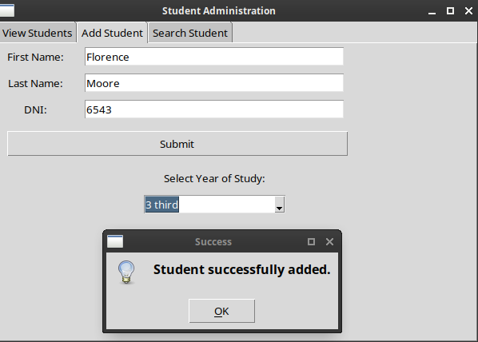
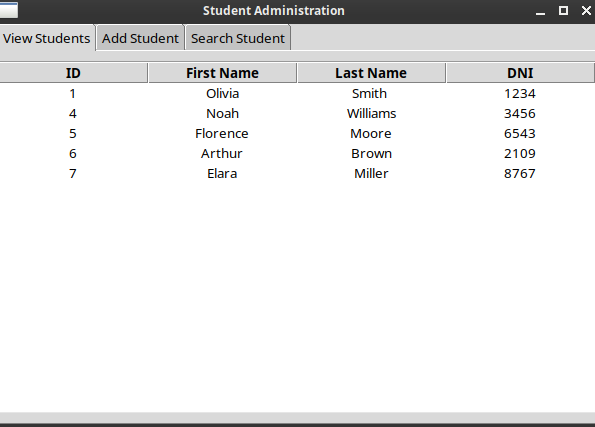
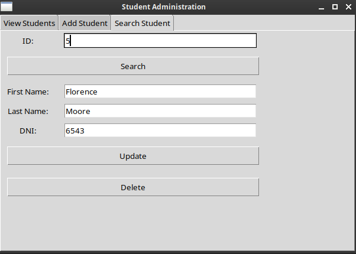

# 🎓 Student Administration System (Tkinter + SQLite)

A simple and modular student administration system built using **Python**, **Tkinter** for the GUI, and **SQLite** for persistent data storage. The system supports full CRUD operations and integrates a basic year-of-study selector.

---

## 📖 Introduction

This project demonstrates how to integrate a local SQLite3 database with a graphical user interface built in Tkinter to manage student records. Users can view, add, search, edit, and delete student entries.

Each student is assigned a name, surname, DNI (ID number), and year of study. The app features real-time updates in the interface and can be used for academic or training purposes.

---

## 🎯 Project Objectives

- Implement a modular and readable Python CRUD application.
- Use SQLite for lightweight data persistence.
- Create a multi-tab GUI using Tkinter's `Notebook`.
- Provide real-time interaction between the UI and database.
- Allow selection of study year using dropdown lists.
- Serve as a learning tool for educational environments.

---

## 🖼️ Screenshots

<div align="center">





</div>

---

## 📁 Project Structure

```text
student_administration/
├── students.db                    # SQLite database file (auto-generated)
├── studentAdministration.py       # Core CRUD logic using SQLite
├── studentAdministrationTk.py     # Tkinter GUI application
└── yearOfStudy.py                 # Module for managing year of study records
```

---

## ⚙️ Setup & Execution

### 1. **Clone the Repository**

```bash
git clone https://github.com/your-username/Learning.git
cd Learning/Python/gui_tkinter/mini_projects/student_administration/
```

### 2. Create Required Tables

Before running the application, make sure to initialize the necessary tables in the database:

```python
# Run this in a Python shell or script:
from studentAdministration import create_students_table
from yearOfStudy import create_year_of_study_table, insert_default_years

create_year_of_study_table()
insert_default_years()
create_students_table()

```

> This step ensures that the students and yearOftudy tables exist before launching the GUI.

### 3. Run the Application

```bash
python3 studentAdministrationTk.py
```

> The application will open a GUI window with tabs to:
>
> - View all students
> - Add a student
> - Search and edit or delete a student

---

## 📜 License

MIT License - Free for educational and personal use.

## 👏 Credits

Developed by [Anthony Banion](https://github.com/anthonybanion)
Argentina, 2024
Project hosted in: [Learning repository](https://github.com/anthonybanion/Learning) — under folder:

```bash
Python/gui_tkinter/mini_projects/student_administration/
```
